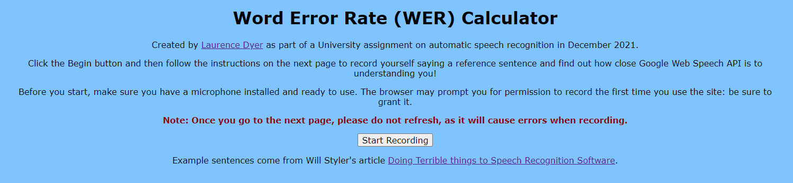
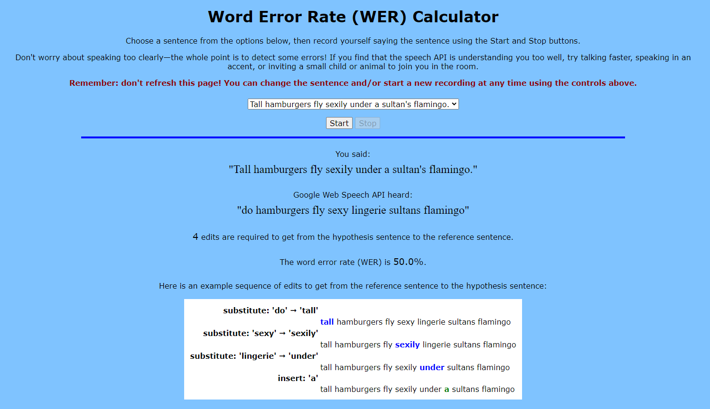

# WER calculator

WER calculator is a Heroku Flask app that records you saying a sentence that is difficult for speech recognition software to detect and calculates the Word Error Rate (WER) between the reference sentence and Google Web To Speech API's hypothesis.

## How to use it

Go to the [Heroku app page](https://wer-calculator.herokuapp.com/) and follow the instructions on the page.

<a href="https://wer-calculator.herokuapp.com/"></img></a>

## Example output

<a href="https://wer-calculator.herokuapp.com/"></img></a>
<a href="https://wer-calculator.herokuapp.com/"></img></a>

## How it works

I implemented the [Levenshtein algorithm and generation of a sequence of edit steps](app/levenshtein/levenshtein.py) from scratch in Python based on the description in Juraskfy and Martin (2008, pp. 74-77). You can see the Levenshtein matrix generated by clicking the "show Levenshtein matrix" link displayed after recording.

The reference sentence and audio data are sent via a POST request to the Flask app, which sends back information about the Word Error Rate as an HTML string.

## Credits

- The Python [SpeechRecognition](https://pypi.org/project/SpeechRecognition/) library is used to interface with the Google Web Speech API.
- Matt Diamond's [Recorderjs](https://github.com/mattdiamond/Recorderjs) plugin is used to record and export audio.
- Example sentences come from Will Styler's article [Doing Terrible things to Speech Recognition Software](https://wstyler.ucsd.edu/posts/terrible_speech_recognition.html).

## References

Jurafsky, D. and Martin J. H. (2008), *Speech and language processing*. 2nd edn. New Jersey: Prentice Hall.
